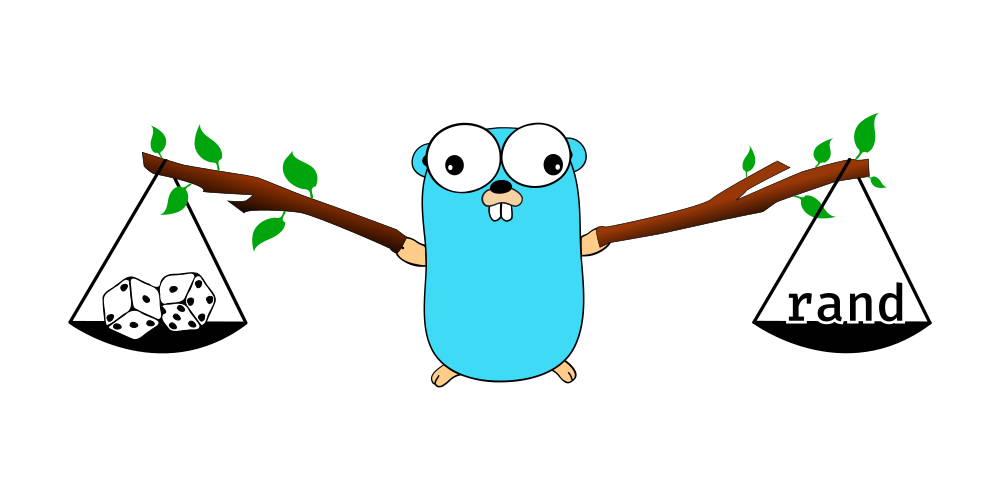

# Go Rand Package

Clean and easy to use `math/rand` clone with a true random generator.



## Table of contents

  - [Go Rand Package](#go-rand-package)
    - [Contents](#table-of-contents)
    - [Why another rand?](#wait-why-another-rand-package)
    - [Comparison](#comparison-of-the-existing-rand-packages)
      - [crypto/rand](#cryptorand)
      - [math/rand](#mathrand)
      - [chutified/rand](#chutifiedrand)
    - [Installation](#installation)
    - [Examples](#examples)

## Wait... Why another rand package?

Well, to put it simply, in the Go's standard library the `math/rand` is not random
enough (not at all actually) and the `crypto/rand` has terrifying and really weak
user interface (vs. the `math/rand`). This rand package takes the best of both worlds
and merges them into a one beautiful and easy to use package with a truly random generator.

## Comparison of the existing rand packages

### `crypto/rand`

  * cryptographically secure random number generator
  + hard to use
  + ugly and weak interface

###`math/rand`

  * an excellent interface 
  * rich method set
  * easy to use
  * great documentation 
  + not random (may be dangerous to use)

#### Why does not `rand.Seed(time.Now().UnixNano())` make the package `math/rand` safe enough?

If the same seed value is provided, everything that was randomly generated can be replicated
and therefore this implementation can not be used when a cryptographically secure random
generation is required.

### `chutified/rand`

  * beautiful math's rand interface 
  * nice and rich method set
  * simple and easy to use
  * true random number generator

## Installation

To install `chutified/rand` package, you need to install Go and set your Go workspace and an environment first.

1. Then you can use the Go command bellow to install `chutified/rand`:

```shell
$ go get -u github.com/chutified/rand
```

2. Import the package in your code.

```go
import "github.com/chutified/rand"
```

3. (Optional) Import `math/rand` and/or `crypto/rand`. Aliases are needed to distinguish the packages.

```go
import (
    crand "crypto/rand"
    mrand "math/rand"
  
    rand "github.com/chutified/rand"
)
```
## Examples

```go
package main

import "github.com/chutified/rand"

func main() {
	r := rand.NewRand()
	
	// generate a random float
	_ = r.Float32()
	_ = r.Float64()
	
	// generate a random integer
	_ = r.Int()
	_ = r.Intn(10) // (0~9)
	
	// shuffle a slice
	fruits := []string{
		"apple",
		"banana",
		"cherry",
		"kiwi",
		"lemon",
		"avocado",
		"mango",
	}
	r.Shuffle(len(fruits), func(i, j int) {
		fruits[i], fruits[j] = fruits[j], fruits[i]
	})
}
```
